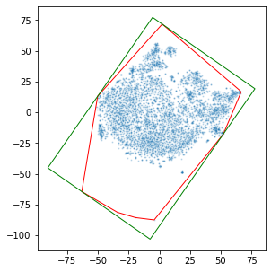
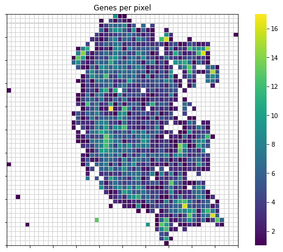
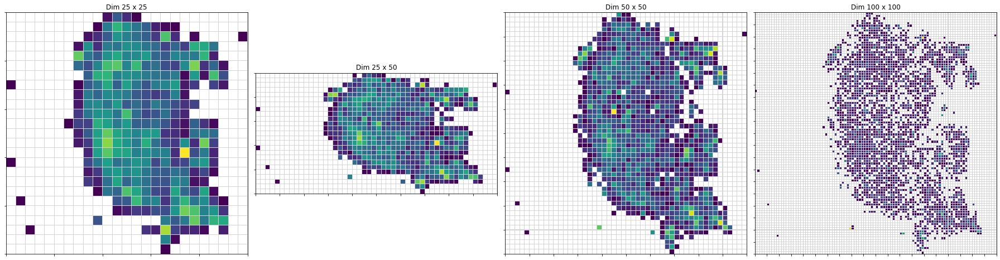
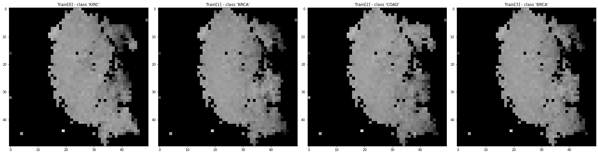
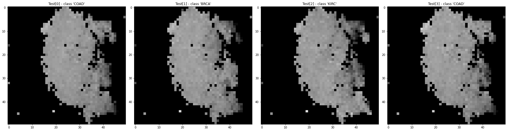

<<<<<<< HEAD


<div align="left">
  
</div>

## AutoML for Text, Image, and Tabular Data

[](https://ci.gluon.ai/view/all/job/autogluon/job/master/)
[](https://pypi.org/project/autogluon/#history)
[](./LICENSE)
[](https://pepy.tech/project/autogluon)


AutoGluon automates machine learning tasks enabling you to easily achieve strong predictive performance in your applications.  With just a few lines of code, you can train and deploy high-accuracy machine learning and deep learning models on text, image, and tabular data.

## Example

```python
# First install package from terminal:
# python3 -m pip install -U pip
# python3 -m pip install -U setuptools wheel
# python3 -m pip install -U "mxnet<2.0.0"
# python3 -m pip install autogluon  # autogluon==0.2.0

from autogluon.tabular import TabularDataset, TabularPredictor
train_data = TabularDataset('https://autogluon.s3.amazonaws.com/datasets/Inc/train.csv')
test_data = TabularDataset('https://autogluon.s3.amazonaws.com/datasets/Inc/test.csv')
predictor = TabularPredictor(label='class').fit(train_data, time_limit=120)  # Fit models for 120s
leaderboard = predictor.leaderboard(test_data)
```

| AutoGluon Task | Quickstart | API |
| :--- | :---: | :---: |
| TabularPredictor | [](https://auto.gluon.ai/stable/tutorials/tabular_prediction/tabular-quickstart.html) | [](https://auto.gluon.ai/stable/api/autogluon.predictor.html#module-0) |
| TextPredictor | [](https://auto.gluon.ai/stable/tutorials/text_prediction/beginner.html) | [](https://auto.gluon.ai/stable/api/autogluon.predictor.html#module-3) |
| ImagePredictor | [](https://auto.gluon.ai/stable/tutorials/image_prediction/beginner.html) | [](https://auto.gluon.ai/stable/api/autogluon.predictor.html#module-1) |
| ObjectDetector | [](https://auto.gluon.ai/stable/tutorials/object_detection/beginner.html) | [](https://auto.gluon.ai/stable/api/autogluon.predictor.html#module-2) |

## News

**Announcement for previous users:** The AutoGluon codebase has been modularized into [namespace packages](https://packaging.python.org/guides/packaging-namespace-packages/), which means you now only need those dependencies relevant to your prediction task of interest! For example, you can now work with tabular data without having to [install](https://auto.gluon.ai/dev/install.html) dependencies required for AutoGluon's computer vision tasks (and vice versa). Unfortunately this improvement required a minor API change (eg. instead of `from autogluon import TabularPrediction`, you should now do: `from autogluon.tabular import TabularPredictor`), for all versions newer than v0.0.15. Documentation/tutorials under the old API may still be viewed [for version 0.0.15](https://auto.gluon.ai/0.0.15/index.html) which is the last released version under the old API.


## Resources

See the [AutoGluon Website](https://auto.gluon.ai/stable/index.html) for [documentation](https://auto.gluon.ai/stable/api/index.html) and instructions on:
- [Installing AutoGluon](https://auto.gluon.ai/stable/index.html#installation)
- [Learning with tabular data](https://auto.gluon.ai/stable/tutorials/tabular_prediction/tabular-quickstart.html)
  - [Tips to maximize accuracy](https://auto.gluon.ai/stable/tutorials/tabular_prediction/tabular-quickstart.html#maximizing-predictive-performance) (if **benchmarking**, make sure to run `fit()` with argument `presets='best_quality'`).  

- [Learning with text data](https://auto.gluon.ai/stable/tutorials/text_prediction/beginner.html)
- [Learning with image data](https://auto.gluon.ai/stable/tutorials/image_prediction/beginner.html)
- More advanced topics such as [Neural Architecture Search](https://auto.gluon.ai/stable/tutorials/nas/index.html)

### Scientific Publications
- [AutoGluon-Tabular: Robust and Accurate AutoML for Structured Data](https://arxiv.org/pdf/2003.06505.pdf) (*Arxiv*, 2020)

### Articles
- [AutoGluon for tabular data: 3 lines of code to achieve top 1% in Kaggle competitions](https://aws.amazon.com/blogs/opensource/machine-learning-with-autogluon-an-open-source-automl-library/) (*AWS Open Source Blog*, Mar 2020)
- [Accurate image classification in 3 lines of code with AutoGluon](https://medium.com/@zhanghang0704/image-classification-on-kaggle-using-autogluon-fc896e74d7e8) (*Medium*, Feb 2020)
- [AutoGluon overview & example applications](https://towardsdatascience.com/autogluon-deep-learning-automl-5cdb4e2388ec?source=friends_link&sk=e3d17d06880ac714e47f07f39178fdf2) (*Towards Data Science*, Dec 2019)

### Hands-on Tutorials
- [From HPO to NAS: Automated Deep Learning (CVPR 2020)](https://hangzhang.org/CVPR2020/)
- [Practical Automated Machine Learning with Tabular, Text, and Image Data (KDD 2020)](https://jwmueller.github.io/KDD20-tutorial/)

### Train/Deploy AutoGluon in the Cloud
- [AutoGluon-Tabular on AWS Marketplace](https://aws.amazon.com/marketplace/pp/prodview-n4zf5pmjt7ism)
- [Running AutoGluon-Tabular on Amazon SageMaker](https://github.com/awslabs/amazon-sagemaker-examples/blob/master/advanced_functionality/autogluon-tabular/AutoGluon_Tabular_SageMaker.ipynb)
- [Running AutoGluon Image Classification on Amazon SageMaker](https://github.com/zhanghang1989/AutoGluon-Docker)

## Citing AutoGluon

If you use AutoGluon in a scientific publication, please cite the following paper:

Erickson, Nick, et al. ["AutoGluon-Tabular: Robust and Accurate AutoML for Structured Data."](https://arxiv.org/abs/2003.06505) arXiv preprint arXiv:2003.06505 (2020).

BibTeX entry:

```bibtex
@article{agtabular,
  title={AutoGluon-Tabular: Robust and Accurate AutoML for Structured Data},
  author={Erickson, Nick and Mueller, Jonas and Shirkov, Alexander and Zhang, Hang and Larroy, Pedro and Li, Mu and Smola, Alexander},
  journal={arXiv preprint arXiv:2003.06505},
  year={2020}
}
```

## AutoGluon for Hyperparameter and Neural Architecture Search (HNAS)

AutoGluon also provides state-of-the-art tools for neural hyperparameter and architecture search, such as for example ASHA, Hyperband, Bayesian Optimization and BOHB. To get started, checkout the following resources

- [General introduction into HNAS](https://www.youtube.com/watch?v=pB1LmZWK_N8&feature=youtu.be)
- [Introduction into HNAS with AutoGluon](https://www.youtube.com/watch?v=GJVwUyVWZas)
- [Example notebook](https://github.com/zhanghang1989/HPO2NAS-Tutorial-CVPR-ECCV2020/blob/master/mlp.ipynb)
- [Example scripts for efficient multi-fidelity HNAS of PyTorch neural network models](https://github.com/awslabs/autogluon/tree/master/examples/hnas/)

Also have a look at our paper ["Model-based Asynchronous Hyperparameter and Neural Architecture Search"](https://arxiv.org/abs/2003.10865) arXiv preprint arXiv:2003.10865 (2020).

```bibtex
@article{abohb,
  title={Model-based Asynchronous Hyperparameter and Neural Architecture Search},
  author={Klein, Aaron and Tiao, Louis and Lienart, Thibaut and Archambeau, Cedric and Seeger, Matthias},
  journal={arXiv preprint arXiv:2003.10865},
  year={2020}
}
```

## AutoGluon for Constrained Hyperparameter Optimization

AutoGluon includes an [algorithm for constrained hyperparameter optimization](https://auto.gluon.ai/dev/tutorials/course/fairbo.html). Check out our paper applying it to optimize model performance under fairness constraints: ["Fair Bayesian Optimization"](https://arxiv.org/abs/2006.05109), AIES (2021).

```bibtex
@article{fairbo,
  title={Fair Bayesian Optimization},
  author={Perrone, Valerio and Donini, Michele and Zafar, Bilal Muhammad and Schmucker, Robin and Kenthapadi, Krishnaram and Archambeau, Cédric},
  journal={AIES},
  year={2021}
}
```


## License

This library is licensed under the Apache 2.0 License.

## Contributing to AutoGluon

We are actively accepting code contributions to the AutoGluon project. If you are interested in contributing to AutoGluon, please read the [Contributing Guide](https://github.com/awslabs/autogluon/blob/master/CONTRIBUTING.md) to get started.
=======
# DeepInsight

This repository contains the original MatLab code for DeepInsight as described in 
the paper [DeepInsight: A methodology to transform a non-image data to an image 
for convolution neural network architecture][1].

# pyDeepInsight

This package provides a python version of the image transformation procedure of 
DeepInsight. This is not guaranteed to give the same results as the published
MatLab code and should be considered experimental.

## Installation
    python3 -m pip -q install git+git://github.com/alok-ai-lab/DeepInsight.git#egg=DeepInsight
    
[1]: https://doi.org/10.1038/s41598-019-47765-6

## Usage

The following is a walkthrough of standard usage of the ImageTransformer class


```python
from pyDeepInsight import ImageTransformer, LogScaler
from sklearn.model_selection import train_test_split
import pandas as pd
import numpy as np

from matplotlib import pyplot as plt
import matplotlib.ticker as ticker
import seaborn as sns
```

Load example TCGA data


```python
expr_file = r"./examples/data/tcga.rnaseq_fpkm_uq.example.txt.gz"
expr = pd.read_csv(expr_file, sep="\t")
y = expr['project'].values
X = expr.iloc[:, 1:].values
X_train, X_test, y_train, y_test = train_test_split(
    X, y, test_size=0.2, random_state=23, stratify=y)
X_train.shape
```


    (480, 5000)


Normalize data to values between 0 and 1. The following normalization 
procedure is described in the 
[DeepInsight paper supplementary information](
https://static-content.springer.com/esm/art%3A10.1038%2Fs41598-019-47765-6/MediaObjects/41598_2019_47765_MOESM1_ESM.pdf)
as norm-2.


```python
ln = LogScaler()
X_train_norm = ln.fit_transform(X_train)
X_test_norm = ln.transform(X_test)
```

Initialize image transformer. There are three built-in feature extraction options, 'tsne', 'pca', and 'kpca' to align with the original MatLab implementation.


```python
it = ImageTransformer(feature_extractor='tsne', 
                      pixels=50, random_state=1701, 
                      n_jobs=-1)
```

Alternatively, any class instance with method `.fit_transform()` that returns a 2-dimensional array of extracted features can also be provided to the ImageTransformer class. This allows for customization of the feature extraction procedure.


```python
from sklearn.manifold import TSNE

tsne = TSNE(n_components=2, perplexity=30, metric='cosine',
            random_state=1701, n_jobs=-1)

it = ImageTransformer(feature_extractor=tsne, pixels=50)

```

Train image transformer on training data. Setting plot=True results in at 
a plot showing the reduced features (blue points), convex full (red), and 
minimum bounding rectagle (green) prior to rotation.


```python
plt.figure(figsize=(5, 5))
_ = it.fit(X_train_norm, plot=True)
```


    

    


The feature density matrix can be extracted from the trained transformer in order to view overall feature overlap.


```python
fdm = it.feature_density_matrix()
fdm[fdm == 0] = np.nan

plt.figure(figsize=(10, 7))

ax = sns.heatmap(fdm, cmap="viridis", linewidths=0.01, 
                 linecolor="lightgrey", square=True)
ax.xaxis.set_major_locator(ticker.MultipleLocator(5))
ax.yaxis.set_major_locator(ticker.MultipleLocator(5))
for _, spine in ax.spines.items():
    spine.set_visible(True)
_ = plt.title("Genes per pixel")
```


    

    


It is possible to update the pixel size without retraining.


```python
px_sizes = [25, (25, 50), 50, 100]

fig, ax = plt.subplots(1, len(px_sizes), figsize=(25, 7))
for ix, px in enumerate(px_sizes):
    it.pixels = px
    fdm = it.feature_density_matrix()
    fdm[fdm == 0] = np.nan
    cax = sns.heatmap(fdm, cmap="viridis", linewidth=0.01, 
                      linecolor="lightgrey", square=True, 
                      ax=ax[ix], cbar=False)
    cax.set_title('Dim {} x {}'.format(*it.pixels))
    for _, spine in cax.spines.items():
        spine.set_visible(True)
    cax.xaxis.set_major_locator(ticker.MultipleLocator(5))
    cax.yaxis.set_major_locator(ticker.MultipleLocator(5))
plt.tight_layout()    
    
it.pixels = 50
```


    

    


The trained transformer can then be used to transform sample data to image 
matricies.


```python
X_train_img = it.transform(X_train_norm)
```

Fit and transform can be done in a single step.


```python
X_train_img = it.fit_transform(X_train_norm)
```

Plotting the image matrices first four samples 
of the training set. 


```python
fig, ax = plt.subplots(1, 4, figsize=(25, 7))
for i in range(0,4):
    ax[i].imshow(X_train_img[i])
    ax[i].title.set_text("Train[{}] - class '{}'".format(i, y_train[i]))
plt.tight_layout()
```


    

    


Transforming the testing data is done the same as transforming the 
training data.


```python
X_test_img = it.transform(X_test_norm)

fig, ax = plt.subplots(1, 4, figsize=(25, 7))
for i in range(0,4):
    ax[i].imshow(X_test_img[i])
    ax[i].title.set_text("Test[{}] - class '{}'".format(i, y_test[i]))
plt.tight_layout()
```


    

    


The image matrices can then be used as input for the CNN model.
>>>>>>> DeepInsight/master
