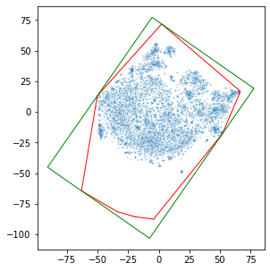
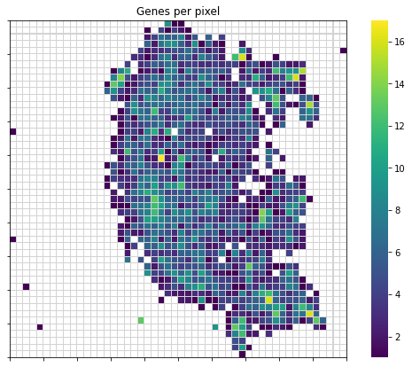
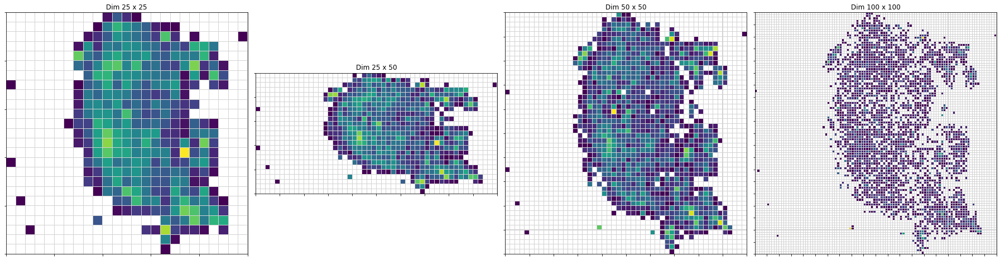
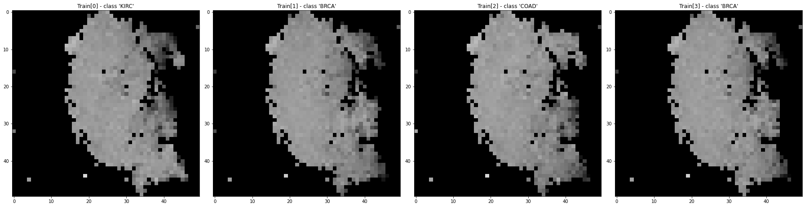
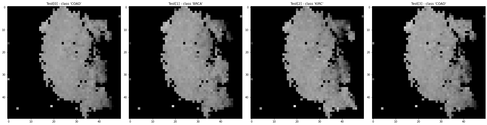

<<<<<<< HEAD


<div align="center">


## Fast and Accurate ML in 3 Lines of Code

[](https://github.com/autogluon/autogluon/releases)
[](https://anaconda.org/conda-forge/autogluon)
[](https://pypi.org/project/autogluon/)
[](https://pepy.tech/project/autogluon)
[](./LICENSE)
[](https://discord.gg/wjUmjqAc2N)
[](https://twitter.com/autogluon)
[](https://github.com/autogluon/autogluon/actions/workflows/continuous_integration.yml)
[](https://github.com/autogluon/autogluon/actions/workflows/platform_tests-command.yml)

[Installation](https://auto.gluon.ai/stable/install.html) | [Documentation](https://auto.gluon.ai/stable/index.html) | [Release Notes](https://auto.gluon.ai/stable/whats_new/index.html)

</div>

AutoGluon, developed by AWS AI, automates machine learning tasks enabling you to easily achieve strong predictive performance in your applications.  With just a few lines of code, you can train and deploy high-accuracy machine learning and deep learning models on image, text, time series, and tabular data.


## 💾 Installation

AutoGluon is supported on Python 3.10 - 3.13 and is available on Linux, MacOS, and Windows.

You can install AutoGluon with:

```python
pip install autogluon
```

Visit our [Installation Guide](https://auto.gluon.ai/stable/install.html) for detailed instructions, including GPU support, Conda installs, and optional dependencies.

## :zap: Quickstart

Build accurate end-to-end ML models in just 3 lines of code!

```python
from autogluon.tabular import TabularPredictor
predictor = TabularPredictor(label="class").fit("train.csv", presets="best")
predictions = predictor.predict("test.csv")
```

| AutoGluon Task      |                                                                                Quickstart                                                                                |                                                                                API                                                                                |
|:--------------------|:------------------------------------------------------------------------------------------------------------------------------------------------------------------------:|:-----------------------------------------------------------------------------------------------------------------------------------------------------------------:|
| TabularPredictor    | [](https://auto.gluon.ai/stable/tutorials/tabular/tabular-quick-start.html) |                 [](https://auto.gluon.ai/stable/api/autogluon.tabular.TabularPredictor.html)                 |
| TimeSeriesPredictor | [](https://auto.gluon.ai/stable/tutorials/timeseries/forecasting-quick-start.html)            | [](https://auto.gluon.ai/stable/api/autogluon.timeseries.TimeSeriesPredictor.html) |
| MultiModalPredictor | [](https://auto.gluon.ai/stable/tutorials/multimodal/multimodal_prediction/multimodal-quick-start.html)            | [](https://auto.gluon.ai/stable/api/autogluon.multimodal.MultiModalPredictor.html) |

## :mag: Resources

### Hands-on Tutorials / Talks

Below is a curated list of recent tutorials and talks on AutoGluon. A comprehensive list is available [here](AWESOME.md#videos--tutorials).

| Title                                                                                                                    | Format   | Location                                                                         | Date       |
|--------------------------------------------------------------------------------------------------------------------------|----------|----------------------------------------------------------------------------------|------------|
| :tv: [Structured Foundation Models Meets AutoML](https://icml.cc/virtual/2025/46786)                                                                               | Expo Talk       | [ICML 2025](https://icml.cc/Conferences/2025)                                                                                      | 2025/07/13  |
| :tv: [AutoGluon 1.2: Advancing AutoML with Foundational Models and LLM Agents](https://neurips.cc/virtual/2024/expo-workshop/100328)                               | Expo Workshop   | [NeurIPS 2024](https://neurips.cc/Conferences/2024)                                                                                | 2024/12/10  |
| :tv: [AutoGluon: Towards No-Code Automated Machine Learning](https://www.youtube.com/watch?v=SwPq9qjaN2Q)                | Tutorial | [AutoML 2024](https://2024.automl.cc/)                                           | 2024/09/09 |
| :tv: [AutoGluon 1.0: Shattering the AutoML Ceiling with Zero Lines of Code](https://www.youtube.com/watch?v=5tvp_Ihgnuk) | Tutorial | [AutoML 2023](https://2023.automl.cc/)                                           | 2023/09/12 |
| :sound: [AutoGluon: The Story](https://automlpodcast.com/episode/autogluon-the-story)                                    | Podcast  | [The AutoML Podcast](https://automlpodcast.com/)                                 | 2023/09/05 |
| :tv: [AutoGluon: AutoML for Tabular, Multimodal, and Time Series Data](https://youtu.be/Lwu15m5mmbs?si=jSaFJDqkTU27C0fa) | Tutorial | PyData Berlin                                                                    | 2023/06/20 |
| :tv: [Solving Complex ML Problems in a few Lines of Code with AutoGluon](https://www.youtube.com/watch?v=J1UQUCPB88I)    | Tutorial | PyData Seattle                                                                   | 2023/06/20 |
| :tv: [The AutoML Revolution](https://www.youtube.com/watch?v=VAAITEds-28)                                                | Tutorial | [Fall AutoML School 2022](https://sites.google.com/view/automl-fall-school-2022) | 2022/10/18 |

### Scientific Publications
- [AutoGluon-Tabular: Robust and Accurate AutoML for Structured Data](https://arxiv.org/pdf/2003.06505.pdf) (*Arxiv*, 2020) ([BibTeX](CITING.md#general-usage--autogluontabular))
- [Fast, Accurate, and Simple Models for Tabular Data via Augmented Distillation](https://proceedings.neurips.cc/paper/2020/hash/62d75fb2e3075506e8837d8f55021ab1-Abstract.html) (*NeurIPS*, 2020) ([BibTeX](CITING.md#tabular-distillation))
- [Benchmarking Multimodal AutoML for Tabular Data with Text Fields](https://datasets-benchmarks-proceedings.neurips.cc/paper/2021/file/9bf31c7ff062936a96d3c8bd1f8f2ff3-Paper-round2.pdf) (*NeurIPS*, 2021) ([BibTeX](CITING.md#autogluonmultimodal))
- [XTab: Cross-table Pretraining for Tabular Transformers](https://proceedings.mlr.press/v202/zhu23k/zhu23k.pdf) (*ICML*, 2023)
- [AutoGluon-TimeSeries: AutoML for Probabilistic Time Series Forecasting](https://arxiv.org/abs/2308.05566) (*AutoML Conf*, 2023) ([BibTeX](CITING.md#autogluontimeseries))
- [TabRepo: A Large Scale Repository of Tabular Model Evaluations and its AutoML Applications](https://arxiv.org/pdf/2311.02971.pdf) (*AutoML Conf*, 2024)
- [AutoGluon-Multimodal (AutoMM): Supercharging Multimodal AutoML with Foundation Models](https://arxiv.org/pdf/2404.16233) (*AutoML Conf*, 2024) ([BibTeX](CITING.md#autogluonmultimodal))
- [Chronos: Learning the Language of Time Series](https://arxiv.org/abs/2403.07815) (*TMLR*, 2024)
- [Multi-layer Stack Ensembles for Time Series Forecasting](https://arxiv.org/abs/2511.15350) (*AutoML Conf*, 2025) ([BibTeX](CITING.md#autogluontimeseries))
- [Chronos-2: From Univariate to Universal Forecasting](https://arxiv.org/abs/2510.15821) (*Arxiv*, 2025) ([BibTeX](CITING.md#autogluontimeseries))
- [TabArena: A Living Benchmark for Machine Learning on Tabular Data](https://arxiv.org/abs/2506.16791) (*NeurIPS Spotlight*, 2025)
- [Mitra: Mixed Synthetic Priors for Enhancing Tabular Foundation Models](https://arxiv.org/abs/2510.21204) (*NeurIPS*, 2025)
- [MLZero: A Multi-Agent System for End-to-end Machine Learning Automation](https://arxiv.org/abs/2505.13941) (*NeurIPS*, 2025)
- [fev-bench: A Realistic Benchmark for Time Series Forecasting](https://arxiv.org/abs/2509.26468) (*Arxiv*, 2025)

### Articles
- [AutoGluon-TimeSeries: Every Time Series Forecasting Model In One Library](https://towardsdatascience.com/autogluon-timeseries-every-time-series-forecasting-model-in-one-library-29a3bf6879db) (*Towards Data Science*, Jan 2024)
- [AutoGluon for tabular data: 3 lines of code to achieve top 1% in Kaggle competitions](https://aws.amazon.com/blogs/opensource/machine-learning-with-autogluon-an-open-source-automl-library/) (*AWS Open Source Blog*, Mar 2020)
- [AutoGluon overview & example applications](https://towardsdatascience.com/autogluon-deep-learning-automl-5cdb4e2388ec?source=friends_link&sk=e3d17d06880ac714e47f07f39178fdf2) (*Towards Data Science*, Dec 2019)

### Train/Deploy AutoGluon in the Cloud
- [AutoGluon Cloud](https://auto.gluon.ai/cloud/stable/index.html) (Recommended)
- [AutoGluon Deep Learning Containers](https://github.com/aws/deep-learning-containers/blob/master/available_images.md#autogluon-training-containers) (Security certified & maintained by the AutoGluon developers)
- [AutoGluon Official Docker Container](https://hub.docker.com/r/autogluon/autogluon)
- [Amazon SageMaker Autopilot](https://aws.amazon.com/blogs/machine-learning/amazon-sagemaker-autopilot-is-up-to-eight-times-faster-with-new-ensemble-training-mode-powered-by-autogluon/) (Managed AutoGluon experience)

## :pencil: Citing AutoGluon

If you use AutoGluon in a scientific publication, please refer to our [citation guide](CITING.md).

## :wave: How to get involved

We are actively accepting code contributions to the AutoGluon project. If you are interested in contributing to AutoGluon, please read the [Contributing Guide](https://github.com/autogluon/autogluon/blob/master/CONTRIBUTING.md) to get started.

## :classical_building: License

This library is licensed under the Apache 2.0 License.
<<<<<<< HEAD

## Contributing to AutoGluon

We are actively accepting code contributions to the AutoGluon project. If you are interested in contributing to AutoGluon, please read the [Contributing Guide](https://github.com/awslabs/autogluon/blob/master/CONTRIBUTING.md) to get started.
=======
# DeepInsight

This repository contains the original MatLab code for DeepInsight as described in 
the paper [DeepInsight: A methodology to transform a non-image data to an image 
for convolution neural network architecture][1].

# pyDeepInsight

This package provides a python version of the image transformation procedure of 
DeepInsight. This is not guaranteed to give the same results as the published
MatLab code and should be considered experimental.

## Installation
    python3 -m pip -q install git+git://github.com/alok-ai-lab/DeepInsight.git#egg=DeepInsight
    
[1]: https://doi.org/10.1038/s41598-019-47765-6

## Usage

The following is a walkthrough of standard usage of the ImageTransformer class


```python
from pyDeepInsight import ImageTransformer, LogScaler
from sklearn.model_selection import train_test_split
import pandas as pd
import numpy as np

from matplotlib import pyplot as plt
import matplotlib.ticker as ticker
import seaborn as sns
```

Load example TCGA data


```python
expr_file = r"./examples/data/tcga.rnaseq_fpkm_uq.example.txt.gz"
expr = pd.read_csv(expr_file, sep="\t")
y = expr['project'].values
X = expr.iloc[:, 1:].values
X_train, X_test, y_train, y_test = train_test_split(
    X, y, test_size=0.2, random_state=23, stratify=y)
X_train.shape
```


    (480, 5000)


Normalize data to values between 0 and 1. The following normalization 
procedure is described in the 
[DeepInsight paper supplementary information](
https://static-content.springer.com/esm/art%3A10.1038%2Fs41598-019-47765-6/MediaObjects/41598_2019_47765_MOESM1_ESM.pdf)
as norm-2.


```python
ln = LogScaler()
X_train_norm = ln.fit_transform(X_train)
X_test_norm = ln.transform(X_test)
```

Initialize image transformer. There are three built-in feature extraction options, 'tsne', 'pca', and 'kpca' to align with the original MatLab implementation.


```python
it = ImageTransformer(feature_extractor='tsne', 
                      pixels=50, random_state=1701, 
                      n_jobs=-1)
```

Alternatively, any class instance with method `.fit_transform()` that returns a 2-dimensional array of extracted features can also be provided to the ImageTransformer class. This allows for customization of the feature extraction procedure.


```python
from sklearn.manifold import TSNE

tsne = TSNE(n_components=2, perplexity=30, metric='cosine',
            random_state=1701, n_jobs=-1)

it = ImageTransformer(feature_extractor=tsne, pixels=50)

```

Train image transformer on training data. Setting plot=True results in at 
a plot showing the reduced features (blue points), convex full (red), and 
minimum bounding rectagle (green) prior to rotation.


```python
plt.figure(figsize=(5, 5))
_ = it.fit(X_train_norm, plot=True)
```


    

    


The feature density matrix can be extracted from the trained transformer in order to view overall feature overlap.


```python
fdm = it.feature_density_matrix()
fdm[fdm == 0] = np.nan

plt.figure(figsize=(10, 7))

ax = sns.heatmap(fdm, cmap="viridis", linewidths=0.01, 
                 linecolor="lightgrey", square=True)
ax.xaxis.set_major_locator(ticker.MultipleLocator(5))
ax.yaxis.set_major_locator(ticker.MultipleLocator(5))
for _, spine in ax.spines.items():
    spine.set_visible(True)
_ = plt.title("Genes per pixel")
```


    

    


It is possible to update the pixel size without retraining.


```python
px_sizes = [25, (25, 50), 50, 100]

fig, ax = plt.subplots(1, len(px_sizes), figsize=(25, 7))
for ix, px in enumerate(px_sizes):
    it.pixels = px
    fdm = it.feature_density_matrix()
    fdm[fdm == 0] = np.nan
    cax = sns.heatmap(fdm, cmap="viridis", linewidth=0.01, 
                      linecolor="lightgrey", square=True, 
                      ax=ax[ix], cbar=False)
    cax.set_title('Dim {} x {}'.format(*it.pixels))
    for _, spine in cax.spines.items():
        spine.set_visible(True)
    cax.xaxis.set_major_locator(ticker.MultipleLocator(5))
    cax.yaxis.set_major_locator(ticker.MultipleLocator(5))
plt.tight_layout()    
    
it.pixels = 50
```


    

    


The trained transformer can then be used to transform sample data to image 
matricies.


```python
X_train_img = it.transform(X_train_norm)
```

Fit and transform can be done in a single step.


```python
X_train_img = it.fit_transform(X_train_norm)
```

Plotting the image matrices first four samples 
of the training set. 


```python
fig, ax = plt.subplots(1, 4, figsize=(25, 7))
for i in range(0,4):
    ax[i].imshow(X_train_img[i])
    ax[i].title.set_text("Train[{}] - class '{}'".format(i, y_train[i]))
plt.tight_layout()
```


    

    


Transforming the testing data is done the same as transforming the 
training data.


```python
X_test_img = it.transform(X_test_norm)

fig, ax = plt.subplots(1, 4, figsize=(25, 7))
for i in range(0,4):
    ax[i].imshow(X_test_img[i])
    ax[i].title.set_text("Test[{}] - class '{}'".format(i, y_test[i]))
plt.tight_layout()
```


    

    


The image matrices can then be used as input for the CNN model.
>>>>>>> DeepInsight/master
=======
>>>>>>> upstream/master
